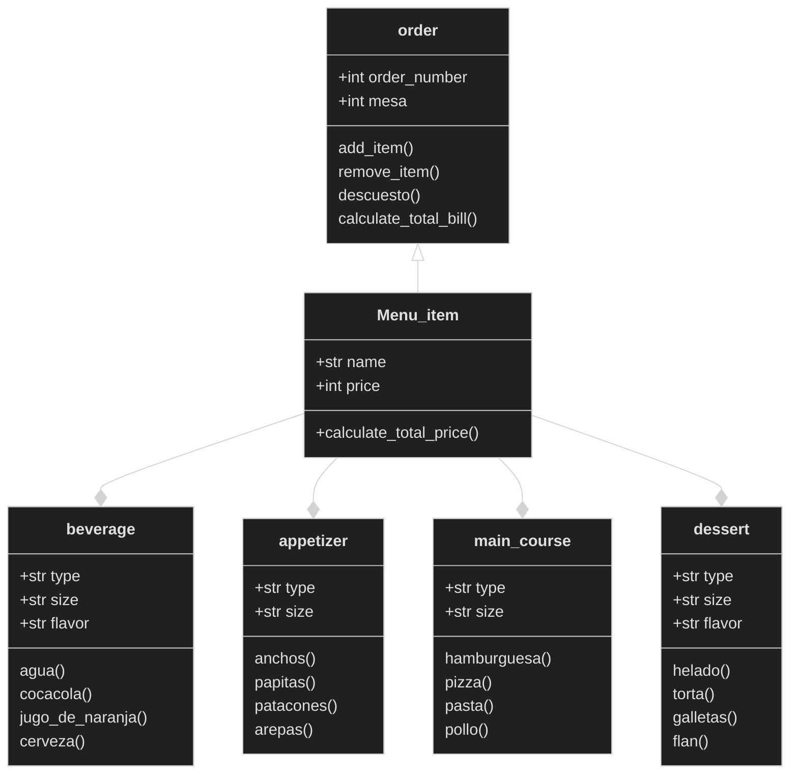

## Reto 3
1. Create a repo with the class exercise
2. **Restaurant scenario:** You want to design a program to calculate the bill for a customer's order in a restaurant.
- Define a base class *MenuItem*: This class should have attributes like name, price, and a method to calculate the total price.
- Create subclasses for different types of menu items: Inherit from *MenuItem* and define properties specific to each type (e.g., Beverage, Appetizer, MainCourse). 
- Define an Order class: This class should have a list of *MenuItem* objects and methods to add items, calculate the total bill amount, and potentially apply specific discounts based on the order composition.

Create a class diagram with all classes and their relationships. 
The menu should have at least 10 items.
The code should follow PEP8 rules.

